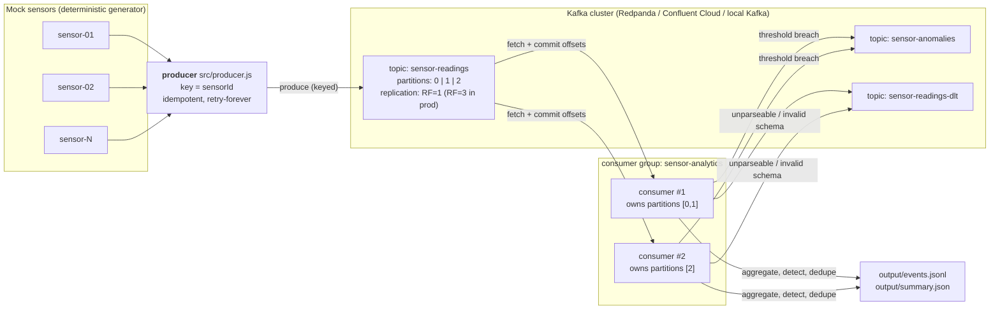

# kafka-sensor-pipeline

An event-driven IoT telemetry pipeline on Apache Kafka.

A **producer** publishes mock sensor readings (temperature / humidity / vibration) to a
partitioned Kafka topic. A **consumer group** reads that topic, aggregates the readings per
sensor, flags anomalies onto a second topic, routes poison messages to a dead-letter topic,
and prints/persists a summary.

Everything is plain Node.js (no framework, one runtime dependency: `kafkajs`), so the same
code runs against a **managed cloud cluster** (Redpanda Cloud / Confluent Cloud) or a
**local single-node Kafka** in Docker.

---

## Table of contents

- [What it demonstrates](#what-it-demonstrates)
- [Architecture](#architecture)
- [Message delivery & ordering — the interesting part](#message-delivery--ordering--the-interesting-part)
- [Quick start](#quick-start)
- [Commands](#commands)
- [Configuration](#configuration)
- [Demo scenarios](#demo-scenarios)
- [Output artefacts](#output-artefacts)
- [Tests](#tests)
- [CI/CD](#cicd)
- [Project layout](#project-layout)
- [Presentation script (2–3 min)](#presentation-script-23-min)
- [Troubleshooting](#troubleshooting)
- [Design decisions, limitations, next steps](#design-decisions-limitations-next-steps)

---

## What it demonstrates

| Topic area | Where to look |
| --- | --- |
| Producer/consumer messaging over a real broker | `src/producer.js`, `src/consumer.js` |
| Partitioning + per-key ordering (FIFO per key) | `src/lib/events.js` (`messageKeyFor`), `KEY_MODE` |
| At-least-once delivery + idempotent consumer | `resolveOffset` after processing, `eventId` de-duplication in `src/lib/aggregate.js` |
| Poison-message handling (dead-letter topic) | `SensorConsumer.deadLetter` |
| Consumer groups / horizontal scaling | any two processes sharing `KAFKA_CONSUMER_GROUP` |
| Fan-out to derived topics | `sensor-anomalies`, `sensor-readings-dlt` |
| Infra as code + tests in CI | `docker-compose.yml`, `.github/workflows/ci.yml` |

## Architecture



Data path in one line: **sensor → producer → `sensor-readings` (keyed by `sensorId`) → consumer
group → aggregates + `sensor-anomalies` + `sensor-readings-dlt`**.

Three topics, on purpose:

| Topic | Purpose | Key |
| --- | --- | --- |
| `sensor-readings` | raw telemetry, N partitions | `sensorId` |
| `sensor-anomalies` | derived stream, one record per threshold breach | `sensorId` |
| `sensor-readings-dlt` | poison messages, with the reason and the raw payload | source partition |

## Message delivery & ordering — the interesting part

**Ordering is per partition, never global.** Kafka only guarantees FIFO *within* a partition,
so the record key decides everything:

- `KEY_MODE=sensor` (default) → `key = sensorId`. The broker hashes the key to a partition, so
  every reading of a sensor lands in the same partition and is consumed in publish order.
  This is also why per-sensor state needs no coordination between consumer instances: one
  sensor is owned by exactly one consumer.
- `KEY_MODE=random` → random key, so the same sensor scatters across partitions and ordering
  is lost. Measured with 4 sensors × 25 readings over 3 partitions:

  | `KEY_MODE` | readings | out-of-order | sequence gaps | missing readings |
  | --- | --- | --- | --- | --- |
  | `sensor` (key = `sensorId`) | 100 | **0** | **0** | **0** |
  | `random` (key = random id) | 100 | **49** | 19 | **49** |

  Reproduce it yourself:

  ```bash
  KAFKA_BROKERS=… KEY_MODE=random npm start && npm run consume   # gaps appear
  ```

- `KEY_MODE=roundrobin` → `key = null`, so the broker's sticky partitioner chooses the
  partition. Ordering then only holds for the records that happen to land in the same
  partition/batch — convenient, but not a guarantee you can depend on.

**Delivery is at-least-once.** The consumer sets `autoCommit: false` and resolves an offset
only *after* the record has been written, so a crash between "processed" and "committed"
replays the record instead of losing it. Replays are made harmless by de-duplicating on
`eventId`, which is what keeps the averages correct. (True exactly-once would need Kafka
transactions across the read-process-write steps; the integration test publishes a duplicate
record and asserts it is counted once.)

**Bad data must not block a partition.** An unparseable or schema-invalid record is written to
`sensor-readings-dlt` with the reason and raw payload, and its offset is still resolved, so one
poison message cannot stall the partition behind it.

## Quick start

### Minimum Requirements for Evaluation (Fastest — Zero Setup)
Requirements: Only **Node.js ≥ 20.0** (no Docker, no Java, and no Kafka broker required).
This allows evaluating and grading the entire pipeline on any system with minimal resources:

```bash
npm install                   # install dependencies (~5 seconds)
npm test                      # 35 hermetic unit tests verifying all core logic (< 0.2s)
npm run demo:sim              # runs end-to-end pipeline in-memory and prints summary table
```

---

### Running with a Real Kafka Broker

If you want to run against a real Apache Kafka cluster:

#### Option A — local broker with Docker

```bash
docker compose up -d          # single-node Kafka 3.9 in KRaft mode
npm install
npm run demo                  # create topics, publish, consume, print summary
```

### Option B — managed cloud broker (Redpanda Cloud / Confluent Cloud)

1. Create a free cluster and a service account (SASL/SCRAM).
2. `cp .env.example .env` and fill in:

   ```dotenv
   KAFKA_BROKERS=redpanda-abc123.eu-central-1.aws.redpanda.com:9092
   KAFKA_SSL=true
   KAFKA_USERNAME=<service-account>
   KAFKA_PASSWORD=<password>
   ```

3. `npm install && npm run demo`

`.env` is git-ignored; credentials are read from the environment only and never logged
(`src/lib/config.js` redacts the summary it prints).

### Option C — no Docker at all (JDK only)

```bash
curl -O https://archive.apache.org/dist/kafka/3.9.1/kafka_2.13-3.9.1.tgz && tar xzf kafka_2.13-3.9.1.tgz
cd kafka_2.13-3.9.1 && KAFKA_CLUSTER_ID="$(bin/kafka-storage.sh random-uuid)"
bin/kafka-storage.sh format -t "$KAFKA_CLUSTER_ID" -c config/server.properties
bin/kafka-server-start.sh config/server.properties      # needs Java 17+
```

Then `KAFKA_BROKERS=localhost:9092 KAFKA_SSL=false npm run demo`.

## Commands

| Command | What it does |
| --- | --- |
| `npm run demo:sim` | Zero-dependency in-memory pipeline demo: no Docker, broker, or cloud needed |
| `npm run demo` | Full pipeline with Kafka broker: auto-runs against Docker/Cloud, or falls back to in-memory |
| `npm run topics` | Create `sensor-readings` / `sensor-anomalies` / `sensor-readings-dlt` if missing (idempotent) |
| `npm start` | Producer only — publish `SENSOR_COUNT × READINGS_PER_SENSOR` readings |
| `npm run consume` | Consumer only — runs until `SIGINT`, or until `CONSUMER_IDLE_TIMEOUT_MS` of silence |
| `npm test` | Unit tests + integration test (integration auto-skips without `KAFKA_BROKERS`) |
| `npm run test:unit` | 35 hermetic tests, no broker needed |
| `npm run test:integration` | End-to-end test against a real broker |
| `npm run lint` | ESLint (flat config) |
| `npm run check` | `lint` + unit tests — exactly what CI's fast gate runs |

Two-terminal demo (shows a long-running consumer, which is what the class demo uses):

```bash
# terminal 1
npm run consume
# terminal 2
npm start
```

## Configuration

All configuration is environment variables (`.env` is loaded automatically; see
`.env.example`). `src/lib/config.js` validates them at start-up and fails fast with a readable
message.

| Variable | Default | Purpose |
| --- | --- | --- |
| `KAFKA_BROKERS` | *(required)* | Comma-separated `host:port` list |
| `KAFKA_SSL` | `true` with credentials, else `false` | TLS to the broker |
| `KAFKA_USERNAME` / `KAFKA_PASSWORD` | – | SASL credentials (both or neither) |
| `KAFKA_SASL_MECHANISM` | `scram-sha-256` | `scram-sha-256` / `plain` |
| `KAFKA_READINGS_TOPIC` | `sensor-readings` | Input topic |
| `KAFKA_ANOMALY_TOPIC` | `sensor-anomalies` | Anomaly output topic |
| `KAFKA_DLT_TOPIC` | `sensor-readings-dlt` | Dead-letter topic |
| `KAFKA_PARTITIONS` | `3` | Partitions used when creating topics |
| `KAFKA_REPLICATION_FACTOR` | `1` | RF when creating topics (`3` in production) |
| `KAFKA_CONSUMER_GROUP` | `sensor-analytics` | Group id — instances sharing it split partitions |
| `KEY_MODE` | `sensor` | `sensor` \| `roundrobin` \| `random` |
| `SENSOR_COUNT` / `READINGS_PER_SENSOR` | `3` / `10` | Generator size |
| `PUBLISH_INTERVAL_MS` | `200` | Delay between batches |
| `EVENT_SEED` | `20260930` | Seed for the deterministic PRNG |
| `ANOMALY_HIGH_C` / `ANOMALY_LOW_C` | `80` / `-10` | Temperature thresholds |
| `VIBRATION_THRESHOLD_MM_S` | `5` | Vibration threshold |
| `CONSUMER_IDLE_TIMEOUT_MS` | `0` (never) | Auto-shutdown after N ms without records (`0` = run until Ctrl-C) |
| `OUTPUT_DIR` | `output` | Where artefacts are written |
| `LOG_LEVEL` | `info` | `silent` \| `error` \| `warn` \| `info` \| `debug` |

Changing `KAFKA_PARTITIONS` on an existing topic does **not** rewrite it — Kafka would have to
re-hash every key, which would break the ordering guarantee. Delete and recreate the topic if
you need a different partition count.

## Demo scenarios

All three were run against a real single-node Kafka 3.9.1 broker; the numbers below are actual
output.

**1 — Steady state.** `npm run demo` with 4 sensors × 12 readings:

```
==> producing 48 readings
[INFO] producer: publish complete: 48 sent, 0 failed
[INFO] consumer: joined group "sensor-analytics" as sensor-pipeline-68d131b0 … {"assignedPartitions":["sensor-readings:[0,1,2]"]}
[INFO] consumer: processed 24 record(s) from sensor-readings[1] offsets 0-23 in 15ms
[WARN] consumer: ANOMALY sensor-01: temperatureC 91.74 > 80; vibrationMmS 6.406 > 5
[INFO] consumer: stopping: idle-timeout
[INFO] consumer: summary
sensor      readings  avgT(C)  minT(C)  maxT(C)  maxVib  gaps  anomalies
sensor-01         12   38.23    18.43    91.74   7.135     0          3
sensor-02         12   21.09    18.64    22.36   0.438     0          0
sensor-03         12   20.93    18.79    22.29   0.397     0          0
sensor-04         12    21.4    18.63    22.48   0.429     0          0
total: 48 readings, 3 anomalies, 0 duplicates, 0 out-of-order, 0 missing
```

**2 — Horizontal scaling.** Start a second consumer with the *same* group id and watch the
partitions get divided (6 partitions, 12 sensors, 180 readings):

```bash
export KAFKA_BROKERS=localhost:9092 KAFKA_SSL=false
export KAFKA_READINGS_TOPIC=sensor-readings-6p KAFKA_PARTITIONS=6 KAFKA_CONSUMER_GROUP=demo-scaling

KAFKA_PARTITIONS=6 npm run topics          # topic with 6 partitions
CONSUMER_IDLE_TIMEOUT_MS=8000 npm run consume &   # consumer #1
CONSUMER_IDLE_TIMEOUT_MS=8000 npm run consume    # consumer #2 (same group)
SENSOR_COUNT=12 READINGS_PER_SENSOR=15 PUBLISH_INTERVAL_MS=0 npm start
```

```
consumer-1: joined group "demo-scaling" … {"assignedPartitions":["sensor-readings-6p:[0,1,2,3,4,5]"]}   ← first join
consumer-1: joined group "demo-scaling" … {"assignedPartitions":["sensor-readings-6p:[0,1,2]"]}           ← after rebalance
consumer-2: joined group "demo-scaling" … {"assignedPartitions":["sensor-readings-6p:[3,4,5]"]}
consumer-1: total: 60 readings, 0 duplicates, 0 out-of-order, 0 missing   (sensors 01-06, 09, 11)
consumer-2: total: 60 readings, 0 duplicates, 0 out-of-order, 0 missing   (sensors 07, 08, 10, 12)
```

The first instance briefly owns all partitions, then the group rebalances and splits them. Each
sensor is owned end-to-end by exactly one instance — no shared state, no locks, no coordination,
because the key already decided who owns what.

**3 — Ordering under the wrong key.** `KEY_MODE=random` against a fresh topic produces
out-of-order and missing readings (table above). `KEY_MODE=sensor` produces none.

## Output artefacts

`output/events.jsonl` — one JSON object per consumed record (appended, replayable audit log):

```json
{"type":"reading","topic":"sensor-readings","partition":1,"offset":"0","status":"accepted","event":{"schemaVersion":1,"eventId":"2026-10-03T02-12-38-047Z-sensor-03-000001","sensorId":"sensor-03","rackId":"rack-C","sequence":1,"ts":"2026-10-03T02:12:38.047Z","temperatureC":18.79,"humidityPct":46.6,"vibrationMmS":0.173}}
{"type":"dead-letter","reason":"invalid-json","errors":["Unexpected end of JSON input"],"deadLetteredAt":"…","source":{"topic":"sensor-readings","partition":1,"offset":"5"},"raw":"{\"sensorId\": \"sensor-01\", \"temp"}
```

`output/summary.json` — final aggregates plus consumer counters:

```json
{
  "totals": { "sensors": 4, "readings": 48, "duplicates": 0, "outOfOrder": 0,
              "sequenceGaps": 0, "missingReadings": 0, "anomalies": 3 },
  "sensors": [
    { "sensorId": "sensor-01", "rackId": "rack-A", "readings": 12, "avgTemperatureC": 38.23,
      "minTemperatureC": 18.43, "maxTemperatureC": 91.74, "maxVibrationMmS": 7.135,
      "lastSequence": 12, "sequenceGaps": 0, "duplicates": 0, "anomalies": 3 }
  ],
  "consumer": { "consumed": 48, "processed": 48, "duplicates": 0, "deadLettered": 0, "anomaliesPublished": 3 }
}
```

`sequence` is per `(sensorId, runId)`. Replaying several producer runs into the same topic
therefore shows up as `out-of-order` — that is the detector doing its job, not a bug. Delete the
topic (or use a fresh group + topic) for a clean single-run demo.

## Tests

```bash
npm test                    # everything (integration skips itself without a broker)
npm run test:unit           # 35 tests, ~0.4s, no broker, no network
KAFKA_BROKERS=localhost:9092 KAFKA_SSL=false npm run test:integration
```

| Suite | Tests | Covers |
| --- | --- | --- |
| `test/unit/config.test.js` | 5 | broker list parsing, defaults, TLS/SASL inference, rejection of half-configured credentials, bad enums/numbers, boolean coercion |
| `test/unit/events.test.js` | 11 | deterministic generator, unique ids, per-sensor sequence ordering, timestamps, key modes, schema validation (missing/wrong types/NaN/bad timestamp/oversized id) |
| `test/unit/aggregate.test.js` | 6 | avg/min/max, per-sensor isolation, idempotent re-delivery, temperature+vibration anomaly rules, gap/out-of-order detection, summary formatting |
| `test/unit/producer.test.js` | 5 | connect/publish/disconnect lifecycle, keys per mode, JSON payloads + headers, broker failure propagation, idempotent producer config |
| `test/unit/consumer.test.js` | 8 | aggregation + offset resolution, offset resolved *after* processing, invalid JSON → DLT, schema-invalid → DLT, anomaly fan-out, replay de-duplication, empty batch, no-producer safety |
| `test/integration/pipeline.test.js` | 4 | topic provisioning, produce → consume → aggregate → dead-letter → anomaly, per-sensor ordering and gap-freedom, dedupe of a replayed record, fan-out topics contain the records |

The consumer logic is written so the Kafka client, the JSONL writer and the summary writer are
**injectable** — that is what keeps 35 of the 39 tests hermetic and fast.

## CI/CD

`.github/workflows/ci.yml` runs on every push to `main` and every pull request:

| Job | What it runs |
| --- | --- |
| `quality` | `npm ci` → `npm run lint` → `npm run test:unit` (no infrastructure, ~30s) |
| `verify` | needs `quality`; starts a real single-node Kafka 3.9.1 **service container**, then runs the unit tests **and** the end-to-end suite against it, then uploads `output/` as an artefact |

Blocking pushes: mark both jobs as required status checks in branch protection
(**Settings → Branches → Branch protection rules → Require status checks to pass**). One command:

```bash
cat > /tmp/protection.json <<'JSON'
{
  "required_status_checks": {
    "strict": true,
    "contexts": ["lint & unit tests", "end-to-end (real Kafka)"]
  },
  "enforce_admins": true,
  "required_pull_request_reviews": { "required_approving_review_count": 1 },
  "restrictions": null,
  "required_linear_history": true,
  "allow_force_pushes": false,
  "allow_deletions": false
}
JSON

gh api -X PUT repos/:owner/:repo/branches/main/protection --input /tmp/protection.json
```

With that in place a red build cannot be merged and direct pushes to `main` are rejected — the
pipeline is what decides, not a human reading the diff.

### Blocking pushes locally (Git Pre-Push Hook)

To guarantee that broken code is blocked *before* it even leaves your local machine, the repository includes a pre-push hook in `.githooks/pre-push`.

It is automatically activated during `npm install` (via the `prepare` script) or manually via:

```bash
npm run setup:hooks
```

Whenever you run `git push`, the hook automatically runs `npm run check` (ESLint + 35 unit tests). If any test fails, the push is immediately aborted.

## Project layout

```
src/
  producer.js          # producer: event generation, keying, batching, graceful shutdown
  consumer.js          # consumer: batching, DLT, anomaly fan-out, offset commits, summary
  lib/
    config.js          # env → validated config (pure, unit tested)
    events.js          # deterministic telemetry generator, key strategy, schema validation
    aggregate.js       # per-sensor state, de-duplication, anomaly rules, snapshot
    kafka.js           # client factory, SASL/TLS options, idempotent topic provisioning
    logger.js          # dependency-free levelled logger
scripts/
  create-topics.js     # npm run topics
  demo.sh              # npm run demo
test/unit, test/integration
.github/workflows/ci.yml
docker-compose.yml     # local single-node Kafka (KRaft)
```

## Presentation script (2–3 min)

1. **The problem (20s).** Sensors produce telemetry continuously; a single database writer
   cannot keep up with 100k devices and, when it restarts, data is lost. I want a durable,
   replayable log between the devices and the analytics, and I want to add analytics workers
   later without touching the devices.
2. **The architecture (30s).** Point at the diagram. Mock sensors → producer → topic
   `sensor-readings` with 3 partitions → consumer group → three outputs: aggregates on disk,
   anomalies onto `sensor-anomalies`, poison messages onto `sensor-readings-dlt`. Same code
   runs against my laptop's Docker Kafka and a managed Redpanda/Confluent cluster — only
   `KAFKA_BROKERS` and credentials change.
3. **The key insight: key = ordering (45s).** Kafka only orders records *within* a partition,
   so the key decides. I key by `sensorId`, so all readings of a sensor hash to one partition
   and arrive in order — and that is also why two consumers can work in parallel without any
   shared state. Run with `KEY_MODE=random` and the summary immediately shows 49 out-of-order
   and 49 missing readings. Ordering is a design decision, not a default.
4. **Failure handling (45s).** Offsets are committed only *after* a record is processed, so a
   crash replays instead of losing data — that means duplicates, so I de-duplicate on `eventId`
   and the averages stay correct. And a record that cannot be parsed goes to the dead-letter
   topic with its raw payload instead of blocking the partition behind it. The integration test
   publishes a duplicate and a poison message and asserts both behaviours.
5. **Scaling + tests (30s).** Run a second consumer with the same group id: it takes half the
   partitions, each instance owns whole sensors, no coordination. Tests: 39 in total, 35 hermetic
   unit tests in 0.4s and an end-to-end suite against a real Kafka service container in CI;
   branch protection makes a red build block the merge.
6. **What I would do next (20s).** Replication factor 3 with `min.insync.replicas=2` so the
   cluster survives a broker loss; schema registry (Avro/Protobuf) with `schemaVersion` enforced
   in the consumer; and exactly-once via transactions if the sink write and the offset commit
   must be atomic.

## Troubleshooting

| Symptom | Cause / fix |
| --- | --- |
| `TimeoutNegativeWarning: -… is a negative number` | Emitted inside `kafkajs`'s internal request queue on Node ≥ 20. Harmless upstream quirk — verified harmless here; silence with `NODE_OPTIONS=--no-warnings` if it bothers you. |
| `KafkaJS v2.0.0 switched default partitioner` | Already handled: the producer sets `Partitioners.DefaultPartitioner` explicitly. |
| `ECONNREFUSED 127.0.0.1:9092` | Broker not running / not ready. `docker compose ps`, then `docker compose logs kafka`. |
| `The coordinator is loading and hence can't process requests` | Benign on the first few seconds after a fresh broker starts; the client retries. |
| `SASL authentication failed` | Hosted clusters need `KAFKA_SSL=true` plus both `KAFKA_USERNAME` and `KAFKA_PASSWORD`. |
| `This server does not host this topic-partition` / no data consumed | Topic not created: run `npm run topics`, and check `KAFKA_READINGS_TOPIC` matches. |
| Consumer prints `0 readings` | It already committed those offsets for this `KAFKA_CONSUMER_GROUP`. Use a new group id (or a fresh topic) to replay. |
| `npm run consume` never exits | Expected — it runs until `SIGINT`. Set `CONSUMER_IDLE_TIMEOUT_MS=5000` to stop when idle. |

## Design decisions, limitations, next steps

**Why Node + `kafkajs`?** No JVM to install, one dependency, and the whole pipeline is ~600
lines of readable JavaScript. The consumer's business logic is dependency-injected, so the
interesting parts are testable without a broker.

**Why file outputs instead of a database?** Keeps the focus on messaging semantics. The
aggregate layer is pure, so swapping `events.jsonl` for Postgres is a one-class change.

**Limitations / next steps**

- `KAFKA_REPLICATION_FACTOR=1` is fine for a demo and wrong for production: set `3` and
  `min.insync.replicas=2`.
- State lives in memory, so a consumer restart replays from the last committed offset and
  recomputes — correct, but a real system would compact state into a changelog topic or a
  database.
- The de-duplication window is bounded (`MAX_TRACKED_EVENT_IDS`); a production version would
  keep a longer window or use a state store.
- `sequence`/`runId` are generator artefacts; a real producer would carry device clock
  information and the consumer would reason about late arrivals explicitly.
- No schema registry yet — `schemaVersion` is checked for presence only.
- Exactly-once: would need `producer.transaction()` + `sendOffsets` in a transaction.

## License

MIT